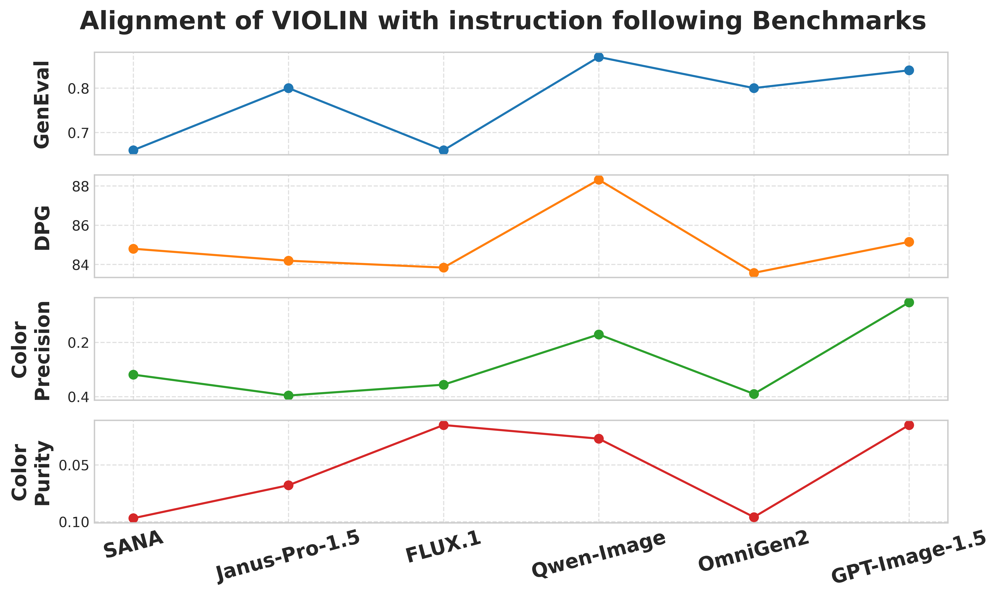

### Performance Consistency across Benchmarks

This figure demonstrates the performance alignment of six leading T2I models across established benchmarks (GeneVal, DPG) and our VIOLIN benchmark (Variation 1 Color Precision, Variation 1 Color Purity). 
The consistent ranking across all four dimensions suggests that VIOLIN effectively captures the core generative capabilities of these models and highlights a universal limitation in precise color obedience.
